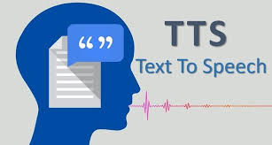

## 🤖 Repository Purpose

This repository is used to **test and experiment with various open-source projects on GitHub** related to:

- Artificial Intelligence (AI)  
- Machine Learning (ML)  
- Deep Learning (DL)  

The main purpose of this repository is for learning, research, and hands-on experimentation with modern AI models.


## 🎙️ Tested Models

Currently, this repository has successfully tested the following model:

### 🔹 VoxCPM: Tokenizer-Free TTS for Context-Aware Speech Generation and True-to-Life Voice Cloning  

<p align="center">
  <a href="https://github.com/OpenBMB/VoxCPM" target="_blank" title="Click to open the original VoxCPM repository">
    
  </a>
</p>

<p align="center">
  🔗 <b>Click the logo to visit the official VoxCPM source code</b>
</p>

- Tokenizer-free Text-to-Speech model  
- Context-aware expressive speech generation  
- High-quality zero-shot voice cloning  

🔗 **Official Source:** https://github.com/OpenBMB/VoxCPM


This project focuses on evaluating the real-world usability of advanced TTS and voice cloning models.

- **Readme:** [VoxCBM README](VoxCBM/README.md)

---

### 🔹 Open-Source LLM (Reasoning)

- **Tested:** I evaluated an open-source LLM that demonstrates reasoning capabilities (chain-of-thought style reasoning and problem solving). Notes and brief results from that evaluation are included in this repository.
 
<p align="center">
  <a href="https://huggingface.co/">
    
  </a>
</p>

- **Browse trending models:** [Explore trending text-generation models on Hugging Face](https://huggingface.co/models?pipeline_tag=text-generation&sort=trending)

- **Readme:** [LLM_Reasoning_Model README](LLM_Reasoning_Model/README.md)

---

### 🔹 LangExtract — Structured Data Extraction with LLMs


🔗 GitHub Repository: https://github.com/google/langextract?tab=readme-ov-file  

- **Readme:** [LangExtract README](LangExtract/README.md)

**LangExtract** is a Python library that uses Large Language Models (LLMs) to extract structured information from unstructured text documents based on user-defined instructions.

### ✨ Key Capabilities

- **Structured Data Extraction**  
  Converts raw text (such as clinical notes, reports, or novels) into organized, structured data outputs.

- **Precise Source Grounding**  
  Maps every extracted entity back to its exact location in the original source text, making verification easy and reliable.

- **Long Document Processing**  
  Handles large documents using text chunking, parallel processing, and multiple extraction passes to ensure high recall.

- **Interactive Visualization**  
  Generates self-contained HTML files that allow you to visually review extracted entities directly in their original context.
---

### 🔹 LEANN — Ultra-Lightweight Vector Index for Local RAG

<p align="center">
  <a href="https://github.com/yichuan-w/LEANN" target="_blank">
    
  </a>
</p>

- Ultra-lightweight vector index with up to **97% storage saving**  
- Fully local & privacy-preserving Retrieval-Augmented Generation (RAG)  
- Supports documents, code, chat history, email, and live data via MCP  

🔗 **Official Source:** https://github.com/yichuan-w/LEANN  

- **Readme:** [LEAN README](LEAN/README.md)


---

### 🔹 Crawl4AI — Web Data Extraction for LLM & AI

<p align="center">
  
</p>

**Crawl4AI** is an open-source Python library for web crawling and scraping, designed to convert HTML content into clean, structured data (Markdown/JSON) optimized for LLMs and AI applications.

#### Key Features

- **AI-Optimized Output:** Removes ads, menus, and clutter; reduces token count; exports Markdown/JSON ready for LLM ingestion.
- **Dynamic Web Handling:** Uses Playwright to render JavaScript, enabling crawling of SPAs and lazy-loaded content.
- **High Performance:** Supports async crawling, multiple URLs at once, and caching.
- **Smart Extraction:** CSS/XPath selectors, content clustering, and LLM-powered extraction.
- **Free & Self-Hosted:** Open source, no paid APIs required, runs locally or on your own server.

👉 **In short:** Crawl4AI is a web crawling tool purpose-built to create “clean, instantly usable” data for AI/LLM projects.

- **Readme:** [Github Repository Crawl4AI](https://github.com/unclecode/crawl4ai)

---

### 🔹 DuckDuckGo Search — Automated Web Search for AI & Data Projects

<p align="center">
  
</p>

The `duckduckgo-search` package (now renamed to `ddgs`) in Python is mainly used to **automate web searching** without using a browser, serving applications that require up-to-date data.

#### 📥 Installation

```bash
pip install duckduckgo-search
pip install -U ddgs
```

> ⚠️ The package was renamed from `duckduckgo-search` to **`ddgs`**.
> You can install either the legacy name or the updated package as shown above.

---
#### Key Features

* **Purpose**: Retrieve search results (text, images, news, videos) directly in Python code.
* **Use cases**:
  * Automated news aggregation and research tools
  * Collecting data for AI/ML projects (real-time data for LLMs via LangChain, etc.)
  * Automating the search and download of documents (PDF, DOC, etc.)

> ⚠️ **Note**: This package has been renamed from `duckduckgo-search` to **`ddgs`**. Install with: `pip install ddgs`

#### Other Ways to Use DuckDuckGo in Python

| Method                    | Main Purpose                                                           | Notes                                                       |
| ------------------------- | ---------------------------------------------------------------------- | ----------------------------------------------------------- |
| **`ddgs` package**        | Flexible automated web searching                                       | Most popular and easiest to use                             |
| **LangChain integration** | Connect search with AI models (LLMs) to build intelligent applications | Used when building AI assistants or search-enabled chatbots |
| **Direct HTML scraping**  | Collect data when there is no official API                             | More complex and fragile if the page structure changes      |

#### 🖥️ How to Test DuckDuckGo UI

If you want to test or run the DuckDuckGo search UI, please go to the `duckduckgo-ui` folder and read the file [duckduckgo-ui/README.md](duckduckgo-ui/README.md) for detailed setup and usage instructions.

#### Practical Applications

* **News aggregation**: Automatically search for and summarize the latest news on a topic.
* **Automated research**: Collect information and academic articles from the web.
* **Providing data for AI**: Help chatbots answer questions about the latest events.

**Original GitHub repository:** [https://github.com/deedy5/ddgs](https://github.com/deedy5/ddgs)


---


### 🔹 Tavily API Search — Automated Web Search, Crawling & Extraction

<div align="center">
  
</div>

The `Tavily_APi_Search` folder provides scripts for automating web search, crawling, and data extraction using the Tavily API:

* **basic_or_advance_search.py**: Perform both basic and advanced searches with Tavily API.
* **crawl.py**: Crawl web pages and collect data from URLs.
* **extract.py**: Extract structured information from crawled content.
* **research.py**: Automate research tasks and poll for results from Tavily API.
* **test_full.py**: Full-featured testing of Tavily API capabilities.
* **test_map.py**: Demonstrate mapping or location-based search features.

🔗 **Original GitHub tavily-python repository:** [https://github.com/tavily-ai/tavily-python](https://github.com/tavily-ai/tavily-python)

---

### 🔹 YouTube API & yt-dlp — Download & Transcript Extraction

<div align="center">
  
</div>

**yt-dlp** is a powerful tool for downloading videos, audio, and subtitles from YouTube and many other platforms. Combine it with **youtube-transcript-api** to automatically extract transcripts (subtitles) from YouTube videos directly in Python.

#### Key Features

* Download video/audio in various qualities
* Download playlists and multilingual subtitles
* Extract transcripts (subtitles) automatically or from user-uploaded captions
* Easily integrate into AI, NLP, and data aggregation workflows

🔗 **Original GitHub yt-dlp repository:** [https://github.com/yt-dlp/yt-dlp](https://github.com/yt-dlp/yt-dlp)

🔗 **Original GitHub youtube-transcript-api repository:** [https://github.com/jdepoix/youtube-transcript-api](https://github.com/jdepoix/youtube-transcript-api)


---

✨ More open-source AI models will be added and tested in this repository in the future.


### 🔹 Gemini API Tool — Google Gemini AI & Data Utilities

<div align="center">
  
</div>


The `GEMINI_API_TOOL` folder provides scripts and notebooks for working with Google Gemini API and related data tasks:

* **Code_Execution.ipynb**: Jupyter notebook for running and testing Gemini API code, including code samples and data processing demos.
* **google_map.py**: Script for interacting with Google Maps, possibly using Gemini API for geolocation or mapping tasks.
* **sales.csv**: Example sales data for analysis or demo purposes.
* **Search_Citation.py**: Script for searching and generating citations, leveraging Gemini API or other search APIs.

🔗 **Google AI Studio:** [https://aistudio.google.com/](https://aistudio.google.com/)

🔗 **Gemini API Documentation:** [https://ai.google.dev/gemini-api/docs](https://ai.google.dev/gemini-api/docs)


### 🔹 Text To Speech Vietnamese

<div align="center">
  
</div>

The **Text To Speech Vietnamese** module provides multiple scripts for converting Vietnamese text into speech using different TTS engines, both **online** and **offline**:

* **vieneu-tts.py**: Vietnamese TTS using `vieneu` with `espeak-ng`, suitable for offline environments.
* **edge-tts.py**: High-quality Vietnamese voice using Microsoft Edge Text-To-Speech (online).
* **gTts.py**: Vietnamese TTS via Google Translate using `gTTS` (online).
* **pyttsx3-tts.py**: Offline text-to-speech using system TTS engines through `pyttsx3`.

### 🔧 Supported Features
- 🇻🇳 Vietnamese language support
- 🌐 Online & Offline TTS options
- 🧪 Easy testing with Python scripts
- 💻 Cross-platform (Windows / Linux / macOS)

> **Note:**
> - Voice quality depends on the selected TTS engine.
> - `edge-tts` provides the best natural Vietnamese voice but requires Internet.
> - `pyttsx3` works fully offline but voice quality depends on OS.


---

## 🔗 Author's Github

<div align="center">


<p align="center">
  <a href="https://github.com/Kietnehi">
    
  </a>
</p>

<h3>🚀 Trương Phú Kiệt</h3>

<a href="https://github.com/Kietnehi">
  
</a>

<br/><br/>

<p align="center">
  
  
</p>

<p align="center">
  <a href="https://github.com/Kietnehi?tab=followers">
    
  </a>
  <a href="https://github.com/Kietnehi">
    
  </a>
</p>


<h3>🛠 Tech Stack</h3>
<p align="center">
  <a href="https://skillicons.dev">
    
  </a>
</p>

<br/>

<h3>🌟 AI Model Demos & Experiments</h3>
<p align="center">
  <a href="https://github.com/Kietnehi/Test-Model-In-Github">
    
    
    
  </a>
</p>
<!-- Quote động -->
<p align="center">
  
</p>
<p align="center">
<i>Thank you for stopping by! Don’t forget to give this repo a <b>⭐️ Star</b> if you find it useful.</i>

</p>


</div>


